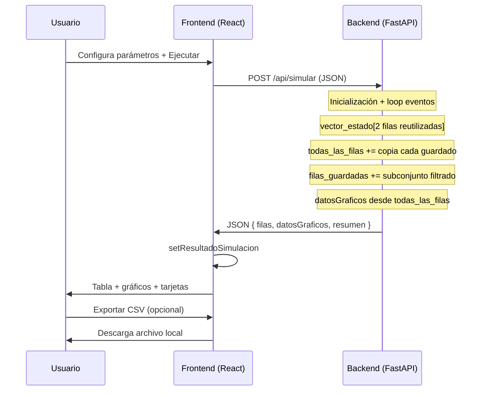

# Documentación técnica — Simulación Expreso Norte (TP4)

Simulador de eventos discretos para el flujo logístico de **Expreso Norte** (UTN FRC). La aplicación permite configurar parámetros, ejecutar la simulación, visualizar el **vector de estado** en una tabla, ver **gráficos** de evolución temporal y **exportar CSV**.

---

## 1. Arquitectura general

El proyecto es una aplicación **cliente-servidor** desacoplada, orquestada con **Docker Compose**:

| Servicio   | Puerto | Tecnología        | Rol                                      |
|-----------|--------|-------------------|------------------------------------------|
| `backend` | 8000   | Python + FastAPI  | Motor de simulación y API REST           |
| `frontend`| 5173   | React + Vite      | Interfaz de usuario                      |

```
┌─────────────────┐         HTTP POST JSON          ┌─────────────────┐
│    Frontend     │  ───────────────────────────►  │    Backend      │
│  (React/Vite)   │  ◄───────────────────────────   │  (FastAPI)      │
│                 │         JSON (filas, gráficos,  │                 │
│  - Parámetros   │              resumen)           │  - Simulación   │
│  - Tabla        │                                 │  - Filtrado     │
│  - Gráficos     │                                 │  - Agregados    │
│  - CSV (local)  │                                 │                 │
└─────────────────┘                                 └─────────────────┘
```

- El **backend** concentra toda la lógica de simulación y el cálculo de datos derivados.
- El **frontend** no simula: solo envía parámetros, recibe resultados y los presenta.
- La comunicación es **stateless por request**: cada clic en “Ejecutar simulación” dispara una corrida completa en el servidor; no hay sesión ni base de datos.

El frontend se conecta a `VITE_BACKEND_URL` (por defecto `http://localhost:8000`). FastAPI expone CORS abierto (`allow_origins=["*"]`) para desarrollo local.

---

## 2. Flujo de comunicación front ↔ back

### 2.1 Request — `POST /api/simular`

El usuario configura parámetros en el panel lateral. Al ejecutar, React arma este cuerpo:

```json
{
  "parametros": {
    "tiempoMax": 480,
    "maxIter": 750,
    "mediaExpress": 40,
    "mediaEstandar": 25,
    "cintaMin": 15,
    "cintaMax": 25,
    "escanerMin": 2,
    "escanerMax": 5,
    "manualBase": 12,
    "manualVar": 3,
    "pRechazo": 0.1
  },
  "horaInicio": 0,
  "cantFilas": 15
}
```

| Campo | Quién lo usa | Significado |
|-------|--------------|-------------|
| `parametros.*` | Backend | Modelo estocástico (medias, rangos, probabilidad de rechazo, límites) |
| `horaInicio` | Backend | Minuto de reloj desde el cual incluir filas en la **tabla** |
| `cantFilas` | Backend | Cantidad máxima de filas de eventos (excl. fila final) en la **tabla** |

`horaInicio` y `cantFilas` son parámetros de **presentación**: solo afectan qué filas van en `filas` de la respuesta. No se re-aplican en el frontend si el usuario los cambia sin volver a simular.

### 2.2 Response — estructura JSON

```json
{
  "filas": [ /* filas filtradas para la tabla */ ],
  "datosGraficos": {
    "permanencia": [ { "reloj", "express", "estandar" }, ... ],
    "operario":    [ { "reloj", "ocupacionAcumulada" }, ... ],
    "cola":        [ { "reloj", "cola" }, ... ]
  },
  "resumen": {
    "tiempoTotal", "promExpress", "promEstandar", "pctOperario",
    "maxColaCintas", "totalLotes", "totalExpress", "totalEstandar",
    "lotesExitExpress", "lotesExitEstandar"
  }
}
```

Cada elemento de `filas` tiene la forma:

```json
{
  "id": 42,
  "iteracion": 42,
  "esFinal": false,
  "valores": [ /* vector de estado: lista plana */ ]
}
```

- **`id` / `iteracion`**: número de iteración del evento en la simulación completa (no un contador de filas visibles).
- **`esFinal`**: `true` solo en la fila de cierre `fin_simulacion`.
- **`valores`**: array con 33 columnas fijas + 2 columnas por cada lote activo en ese instante.

### 2.3 Qué hace cada capa

| Responsabilidad | Backend | Frontend |
|-----------------|---------|----------|
| Generación de números aleatorios | ✓ | — |
| Cola de eventos / reloj | ✓ | — |
| Vector de estado | ✓ | Solo muestra |
| Filtrado `horaInicio` / `cantFilas` | ✓ | — |
| Series temporales para gráficos | ✓ (pre-calculadas) | Solo dibuja |
| Indicadores del resumen | ✓ | Solo muestra |
| Render tabla / gráficos | — | ✓ |
| Exportación CSV | — | ✓ (en el navegador) |
| Persistencia | — | Estado React en memoria |

---

## 3. Uso de memoria

### 3.1 Backend — durante una simulación

El endpoint `simular()` define todo el estado **dentro de la función** (closure). Al terminar la request, Python puede liberar esa memoria. No hay acumulación entre ejecuciones.

**Estructuras principales:**

| Estructura | Propósito | Crecimiento |
|------------|-----------|-------------|
| `sistema` | Estado mutable del modelo (colas, servidores, lotes activos, acumuladores) | O(lotes activos) |
| `vector_estado` | **Dos filas** reutilizadas (`[anterior, actual]`) | **Constante** — diseño clave para no duplicar el vector en cada evento |
| `lotesActivos` | Diccionario `id → lote` | Máximo = camionetas simultáneas en el sistema |
| `todas_las_filas` | Copia del vector en **cada** guardado (para gráficos) | O(N) — N = eventos guardados en historial completo |
| `filas_guardadas` | Copia del vector solo para filas que pasan el filtro de tabla | O(cantFilas + 2) típicamente |

**Doble almacenamiento intencional:**

1. **`filas_guardadas`**: subconjunto liviano para la tabla (filtrado por reloj y cantidad).
2. **`todas_las_filas`**: historial completo (inicialización + todos los eventos + cierre) usado una sola vez al final para armar `datosGraficos`.

En cada llamada a `guardar_fila()` se hace `fila.copy()` — es decir, se **duplica la lista** `valores` en memoria. Para una simulación con miles de eventos, el costo dominante suele ser:

```
memoria ≈ N_eventos × (33 + 2 × lotes_activos_promedio) × tamaño_celda
```

`datosGraficos` reduce lo que viaja al frontend para gráficos: en lugar de reenviar vectores completos, solo se envían 3–4 números por punto temporal.

**Fila final sin lotes dinámicos:** `escribir_estado_general(..., incluir_lotes=False)` trunca el vector a 33 columnas fijas en el cierre, ahorrando columnas innecesarias en la última fila.

### 3.2 Backend — respuesta HTTP

FastAPI serializa el diccionario de retorno a JSON. El tamaño de la respuesta depende de:

- Longitud de `filas` (filtradas).
- Longitud de `datosGraficos.*` (todos los eventos, sin filtrar).
- Campos fijos de `resumen`.

Para `maxIter = 100_000`, `datosGraficos` puede tener ~100k puntos × 3 series; es el principal candidato a respuestas grandes.

### 3.3 Frontend — memoria del navegador

Tras `fetch`, el JSON completo se guarda en:

```js
const [resultadoSimulacion, setResultadoSimulacion] = useState(null)
```

Eso implica **una copia en memoria del cliente** con la misma información que devolvió el servidor.

Derivados calculados con `useMemo` (no duplican los datos crudos, solo referencias/transformaciones ligeras):

- `filasVisibles` → alias de `resultadoSimulacion.filas`
- `cantidadLotesVisible`, `columnas`, `columnasLotes`
- `ticksEjeX`, `ticksEjeYPermanencia`, etc.

**CSV:** se construye un string en memoria al exportar (`Blob`), se descarga y se revoca la URL. No se persiste en disco del servidor.

**Gráficos (Recharts):** reciben arrays ya listos; Recharts crea estructuras internas para SVG. No se re-procesa el vector de estado en el cliente.

### 3.4 Resumen de estrategia memoria

```
Simulación:  2 filas vector reutilizadas  →  bajo coste por evento
Historial:   copias en listas             →  coste lineal en N eventos
Red:         JSON unidirectional           →  pico al recibir respuesta
UI:          un state + memos             →  sin re-simular al cambiar vista
Gráficos:    datosGraficos compactos      →  evita enviar vectores completos otra vez
```

---

## 4. Modelo de simulación (backend)

### 4.1 Paradigma: simulación por eventos discretos

El reloj **no avanza en pasos fijos**: salta al tiempo del **próximo evento** entre candidatos:

1. Llegada camioneta Express  
2. Llegada camioneta Estándar  
3. Fin descarga cinta 1  
4. Fin descarga cinta 2  
5. Fin escaneo  
6. Fin procesamiento manual  

`elegir_proximo_evento()` ordena por tiempo y, en empate, por `prioridad`.

### 4.2 Recursos y colas

| Recurso | Cantidad | Cola asociada |
|---------|----------|----------------|
| Cinta 1 / Cinta 2 | 2 servidores | **Una sola** `colaDescarga` (Express tiene prioridad al insertar) |
| Escáner | 1 | `colaEscaner` |
| Operario | 1 | `colaManual` |

### 4.3 Flujo de un lote

```
Llegada → Descarga (cinta) → Escaneo → ¿Rechazado?
                              │              │
                              │         Sí → Cola manual → Operario → Salida
                              │              │
                              └──────── No → Salida (estadísticas)
```

### 4.4 Distribuciones aleatorias

| Proceso | Distribución | Parámetros |
|---------|--------------|------------|
| Entre arribos Express / Estándar | Exponencial | `mediaExpress`, `mediaEstandar` |
| Descarga en cinta | Uniforme | `cintaMin`, `cintaMax` |
| Escaneo | Uniforme | `escanerMin`, `escanerMax` |
| Procesamiento manual | Uniforme | `manualBase ± manualVar` |
| Aceptación post-escaneo | Bernoulli | `pRechazo` |

Cada sorteo guarda `rnd` y `tiempo` en columnas transitorias del vector cuando corresponde.

### 4.5 Vector de estado — doble fila

Patrón **previous / current**:

```python
vector_estado = [fila_vacia, fila_vacia]

def crear_fila_actual(evento, reloj):
    vector_estado[0] = vector_estado[1]
    vector_estado[1] = preparar_fila_desde_anterior(vector_estado[0])
    # limpia columnas transitorias; mantiene estado persistente
```

`preparar_fila_desde_anterior()` copia las 33 columnas fijas y vacía solo las **transitorias** (RND/tiempos de eventos puntuales).

### 4.6 Columnas fijas (33)

Índices `0–32` definidos en `COL` (backend) y `COL` (frontend) — deben coincidir.

| Índices | Contenido |
|---------|-----------|
| 0–1 | Evento, Reloj |
| 2–7 | Llegadas Express y Estándar (RND, tiempo, próxima) |
| 8–14 | Descarga (RND, tiempo, fin cintas, estados, cola única) |
| 15–16 | Lectura / Escáner (**compartidos**: RND/Resultado vs Estado/Cola según evento) |
| 17–19 | Fin escaneo |
| 20–22 | Fin procesamiento manual |
| 23–24 | Operario |
| 25–30 | Contadores y acumulados estadísticos |

**Columnas dinámicas:** por cada lote en `lotesActivos`, se agregan al final `[estado, tiempoEntrada]`.

### 4.7 Guardado de filas — `guardar_fila()`

En **cada** guardado:

1. Se appendea a `todas_las_filas` (historial completo).
2. Si `es_final` → siempre a `filas_guardadas` con `esFinal: true`.
3. Si no: solo si `reloj >= hora_inicio` y aún no se alcanzó `cant_filas`.
4. La fila de **Inicialización** (reloj 0) sigue las mismas reglas: solo aparece si `horaInicio = 0`.

La **fila final** (`fin_simulacion`) se genera al `tiempoMax` con tiempo de operario proyectado hasta el cierre.

---

## 5. Generación de datos para gráficos (backend)

Tras el loop, se recorre **`todas_las_filas`** (simulación completa, sin filtro de tabla):

```python
datos_graficos["permanencia"].append({
    "reloj": reloj,
    "express": ac_express / express_count si hay lotes,
    "estandar": ac_estandar / estandar_count,
})
datos_graficos["operario"].append({
    "reloj": reloj,
    "ocupacionAcumulada": valores[AC_TIEMPO_OPERARIO],
})
datos_graficos["cola"].append({
    "reloj": reloj,
    "cola": valores[COLA_DESCARGA],
})
```

| Gráfico | Serie | Interpretación |
|---------|-------|----------------|
| Permanencia | express, estandar | Promedio acumulado de tiempo en sistema por tipo hasta ese instante |
| Operario | ocupacionAcumulada | Minutos acumulados de ocupación del operario |
| Cola | cola | Cantidad de camionetas en cola de descarga |

**Por qué no se calculan en el frontend:** si la tabla muestra 15 filas pero la simulación tiene 800 eventos, los gráficos deben mostrar los **800 puntos**. Pre-calcular en el backend garantiza coherencia y evita reenviar vectores completos.

---

## 6. Frontend — componentes y responsabilidades

### 6.1 Estado React

| State | Contenido |
|-------|-----------|
| `parametros` | Todos los inputs del panel (incluye `horaInicio`, `cantFilas`) |
| `resultadoSimulacion` | Respuesta completa del último `POST /api/simular` |
| `simulando` | Flag de carga |
| `errorSimulacion` | Mensaje si falla el fetch |

### 6.2 Tabla del vector de estado

1. **`filasVisibles`** = `resultadoSimulacion.filas` sin re-filtrar.
2. **`cantidadLotesVisible`**: máximo de pares `(Estado, Tiempo entrada)` entre filas visibles.
3. **`columnas`**: `COLUMNAS_VECTOR` (33) + columnas dinámicas de lotes.
4. **Cabecera triple:**
   - Fila super-grupo (“Lotes” sobre columnas dinámicas).
   - Fila `GRUPOS_VECTOR` (agrupación pedagógica alineada al Excel).
   - Fila de nombres de columna.
5. **Cuerpo:** cada celda usa `formatearNumero(fila.valores[index])`.
6. **Columna `#`:** muestra `fila.id` (iteración real). Sticky horizontal (`left: 0`).
7. **Fila final:** clase `final-row`, sticky inferior en cada `td`, texto dorado (`--accent-strong`), fondo sólido `--bg-panel`.

### 6.3 Gráficos (Recharts)

Los tres `LineChart` consumen directamente:

- `resultadoSimulacion.datosGraficos.permanencia`
- `resultadoSimulacion.datosGraficos.operario`
- `resultadoSimulacion.datosGraficos.cola`

**Ejes uniformes (no automáticos por punto de dato):**

| Eje | Función | Base |
|-----|---------|------|
| X | `calcularTicksEje(tiempoTotal)` | `resumen.tiempoTotal`, múltiplos de 10 |
| Y | `calcularTicksY(maxSerie)` | máximo de la serie, múltiplos de 5 |

`XAxis`: `type="number"`, `domain={[0, tiempoTotal]}`, `ticks` calculados.  
`YAxis`: `ticks` calculados, `domain={[0, 'auto']}`. Cola: `allowDecimals={false}`.

El frontend **no** deriva series desde `filas[].valores`; solo renderiza lo que envió el backend.

### 6.4 Exportación CSV

100 % en el **navegador**, sin llamada al backend:

1. Arma 3 filas de encabezado (super-grupo, grupos, nombres) igual que la tabla visual.
2. Agrega una fila por cada elemento de `filasVisibles`.
3. Separador `;`, BOM UTF-8 (`\uFEFF`) para Excel en español.
4. Escapa comillas y saltos de línea.
5. Crea `Blob` → descarga `simulacion_expreso_norte.csv` → `URL.revokeObjectURL`.

El CSV exporta **exactamente lo visible en tabla** (filas filtradas), no la simulación completa ni los datos de gráficos.

### 6.5 Panel de resumen

`StatCard` muestra campos de `resultadoSimulacion.resumen` (promedios finales, % operario, máximos, totales). Son valores **globales de la corrida**, no de una fila puntual.

---

## 7. Diagrama de flujo completo



---

## 8. Archivos clave

| Archivo | Rol |
|---------|-----|
| `backend/main.py` | API, simulación, vector, filtrado, `datosGraficos`, `resumen` |
| `frontend/src/App.jsx` | UI, fetch, tabla, gráficos, CSV |
| `frontend/src/App.css` | Estilos tabla (sticky, fila final) |
| `docker-compose.yml` | Servicios backend + frontend con hot-reload |
| `VecEstTP4.xlsx` | Referencia de diseño del vector (no lo lee el código) |

---

## 9. Decisiones de diseño relevantes

1. **Simulación solo en backend** — una sola fuente de verdad; el front no puede desincronizarse en la lógica estocástica.
2. **Dos listas de filas** — equilibrio entre tabla filtrada e historial completo para gráficos.
3. **Doble fila en memoria** — evita clonar el vector entero en cada evento salvo al persistir historial.
4. **`datosGraficos` pre-agregados** — payload más chico y gráficos independientes de `cantFilas`.
5. **Filtrado solo al simular** — cambiar `horaInicio` sin re-ejecutar no altera la tabla (comportamiento esperado).
6. **CSV en cliente** — sin carga extra al servidor; coherente con “exportar lo que veo”.
7. **Índices compartidos 15–16** — reflejan el Excel (lectura vs escáner en las mismas columnas según tipo de evento).

---

## 10. Límites y consideraciones

- **`maxIter`** está acotado a 100 000 en backend.
- Respuestas muy grandes pueden tardar en serializar/transmitir si hay decenas de miles de eventos.
- No hay autenticación ni almacenamiento de corridas anteriores.
- Recargar la página borra `resultadoSimulacion` del estado React.
- El número de iteración en la columna `#` es el de la simulación; si se filtra por `horaInicio`, los índices visibles pueden no ser consecutivos desde 1.

---

## 11. Cómo ejecutar

```bash
docker-compose up --build
```

- Frontend: http://localhost:5173  
- Backend: http://localhost:8000  
- Documentación interactiva API: http://localhost:8000/docs  

---

*Documento generado para el proyecto Simulación Expreso Norte — TP4 UTN FRC.*
